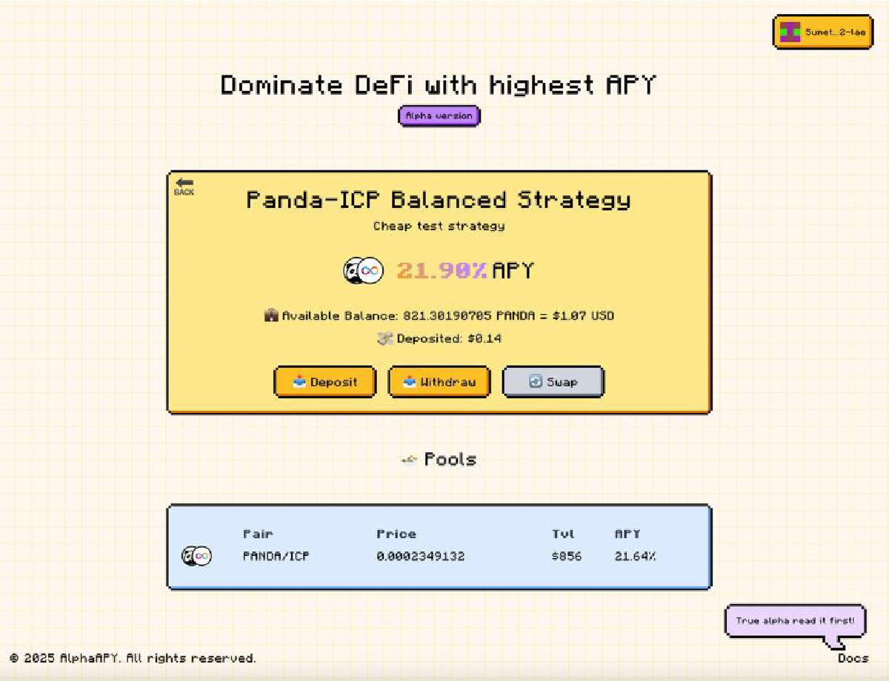
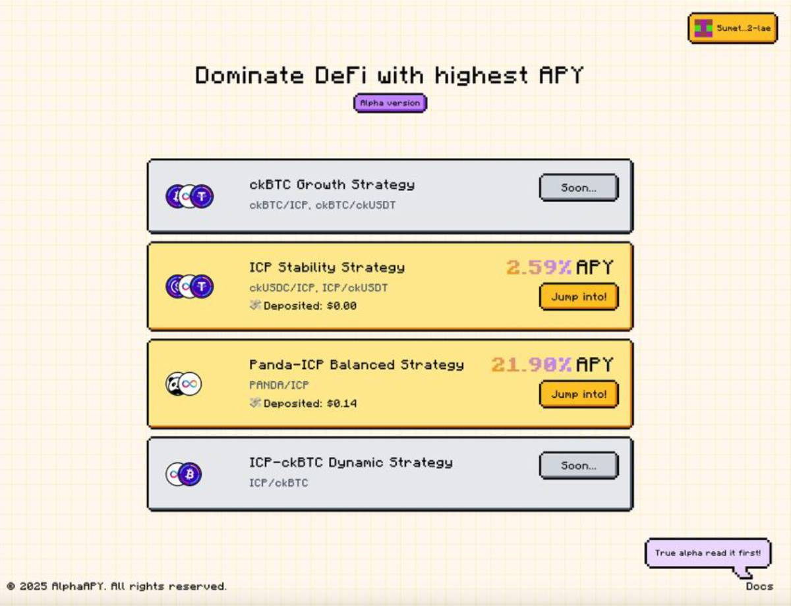

<div style="display:flex;flex-direction:row;gap:20px;">
  <a href="https://47r3x-paaaa-aaaao-qj6ha-cai.icp0.io/" target="_blank" rel="noopener noreferrer">
    
  </a>

  <a href="https://47r3x-paaaa-aaaao-qj6ha-cai.icp0.io/" target="_blank" rel="noopener noreferrer">
    
  </a>
</div>

# Alfa APY

The [AlfaAPY](https://47r3x-paaaa-aaaao-qj6ha-cai.icp0.io/) is the first yield optimization DeFi protocol built on the Internet Computer Protocol (ICP) utilizing **ckBTC**, similar to Yearn Finance on Ethereum. The protocol automatically maximizes returns for users by finding the highest-yielding liquidity pools and dynamically reallocating assets to optimize yield.

## Description

AlfaAPY is designed to solve the challenge of finding and utilizing the best yield opportunities in the ICP ecosystem. The protocol continuously monitors APY across various liquidity pools from different DeFi providers like KongSwap, ICPSwap, and others. When a higher-yielding opportunity is detected, it automatically rebalances funds to maximize returns.

With an easy-to-use interface for managing investments and tracking performance, users can effortlessly monitor their yield optimization strategies while leveraging the power of **ckBTC** for efficient cross-chain transactions and yield generation.


### Interface

The [AlfaAPY](https://47r3x-paaaa-aaaao-qj6ha-cai.icp0.io/) interface provides an intuitive and user-friendly experience for managing your yield optimization strategies.

<div style="display:flex;flex-direction:row;gap:20px;">
  <a href="https://47r3x-paaaa-aaaao-qj6ha-cai.icp0.io/" target="_blank" rel="noopener noreferrer">
    
  </a>
  <a href="https://47r3x-paaaa-aaaao-qj6ha-cai.icp0.io/" target="_blank" rel="noopener noreferrer">
    
  </a>
</div>

### How It Works

1. **Deposit**: Users deposit assets (ckBTC, ICP, etc.) into their chosen strategy
2. **Monitoring**: Protocol tracks APY across various liquidity pools
3. **Rebalancing**: Funds automatically move to higher-yielding pools
4. **Withdrawal**: Users can withdraw assets with accumulated yield anytime

## Features

- **Automated Yield Optimization**: Automatically moves assets between liquidity pools and providers to maximize APY.
- **Multiple Asset Strategies**: Supports various assets including **ckBTC**, ICP, and stablecoin pairs.
- **Multiple Providers**: Integrates with various DeFi providers on ICP, including Kongswap and ICPSwap.
- **Non-custodial**: Users maintain control of their assets while benefiting from optimization.
- **Secure and Transparent**: Built on the secure and transparent infrastructure of ICP.
- **Low Fees**: Minimal fees compared to manual rebalancing due to efficient **ckBTC** transactions

## Architecture

[AlfaAPY](https://47r3x-paaaa-aaaao-qj6ha-cai.icp0.io/) is built on a modular architecture with the following components:

### Core Components

- **Vault**: Main entry point for user deposits and withdrawals
- **Strategies**: Asset-specific implementations for yield optimization
- **Liquidity Service**: Handles interactions with liquidity pools
- **Swap Service**: Manages token swaps between different assets
- **Repository**: Manages persistent state and strategy data

### Documentations

- [Calculator Functions Documentation](docs/liquidity_pools_calculation_flow.md) - Detailed documentation of share calculation and liquidity distribution functions
- [Kong Swap Provider Documentation](docs/kong_swap_provider_flow.md) - Documentation for working with Kong Swap pools and APY calculations

## Technologies

### Backend

- **Rust**: Primary programming language
- **Internet Computer Protocol (ICP)**: Blockchain platform
- **Candid**: Interface description language for ICP
- **KongSwap/ICPSwap**: DEX integrations for liquidity provision and swaps
- **ICRC-1/ICRC-2**: Token standards for asset handling

### Frontend

- **TypeScript**: Frontend programming language
- **Vite**: Build tool and development server
- **React**: UI framework
- **@dfinity packages**: Internet Computer SDK
- **@nfid/identitykit**: Authentication integration
- **@reduxjs/toolkit**: State management
- **TailwindCSS**: Utility-first CSS framework

## Getting Started

### Prerequisites

Ensure you have the following tools installed before diving into development:

- **Rustup** `^v1.27.1`
- **DFX** `^v0.24.0`
- **jq** `^1.6`
- **Node.js**
- **npm**

> ⚠️ Note: These versions are specific for compatibility with the Internet Computer SDK.

---

### Launch Local DFX

Begin by starting a local DFX instance:

```bash
dfx start --background --clean
```

### Deploy Vault

To deploy the vault canister with the specified ID, run:

```bash
dfx deploy vault --no-wallet --specified-id "hx54w-raaaa-aaaaa-qafla-cai"
```

## Unit Tests

### Run Unit Tests

```bash
cargo test --lib
```

## Integration Tests

### Prerequisites

Install these dependencies before testing:

- **NodeJS** `^v20.16.0`
- **Yarn** `^v1.22.22`

### Run Integration Tests

To run the integration tests, use:

```bash
npm i && npm run test
```

## License

This project is licensed under the MIT License - see the LICENSE file for details.

## Source code

- [Backend](https://github.com/olsemeno/alfaAPY)
- [Frontend](https://github.com/olsemeno/Alfa_APY_FE)

## Links

- [Application Website](https://47r3x-paaaa-aaaao-qj6ha-cai.icp0.io/)
- [Internet Computer](https://internetcomputer.org)
- [DFINITY Foundation](https://dfinity.org)
